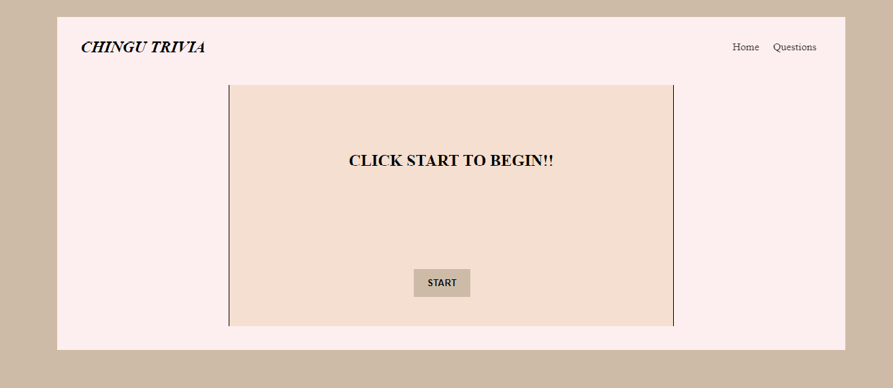
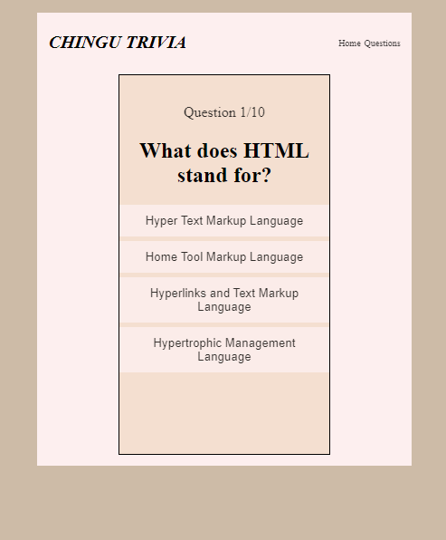
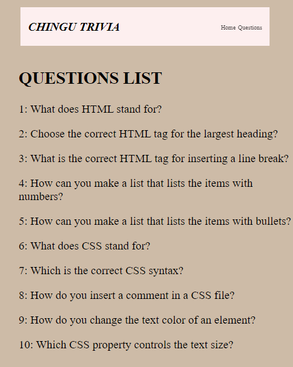
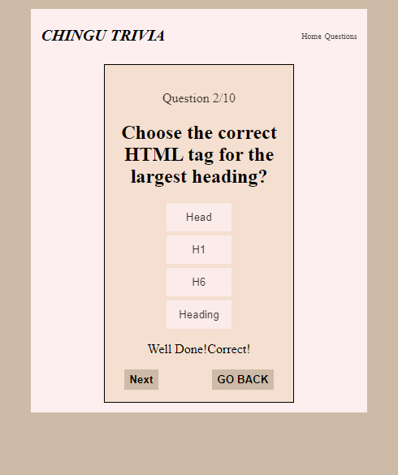

# TRIVIA

It's a simple website where 10 questions will be displayed to the user which are hard-coded in the script file(js/index.js).Each question will have 4 options to choose from and the button to proceed further will not appear unless user selects an option. Theirs's also an option to back to the previous question. At the end the final score along side the option to restart will appear.

## Features

- Fully Responsive
- Grid Layout
- Cross platform

## Color Reference

| Color             | Hex                                                                |
| ----------------- | ------------------------------------------------------------------ |
| Wisp Pink | #FDEFEF |
| Albescent White | #F4DFD0 |
| Sisal| #DAD0C2|
| Vanilla| #CDBBA7|
|Color Palette|https://colorhunt.co/palette/fdefeff4dfd0dad0c2cdbba7|

## Screenshots

## Links
- [GitHub-Repository](https://github.com/rajat1997-pro/TRIVIA)
- [Live-Preview](https://rajat1997-pro.github.io/TRIVIA/)

## 🛠 Language's Used
JavaScript, HTML, CSS...

## Feedback

If you have any feedback, please reach out to at rajatshekhawat38@gmail.com

## Authors

- [rajat1997-pro](https://github.com/rajat1997-pro)
